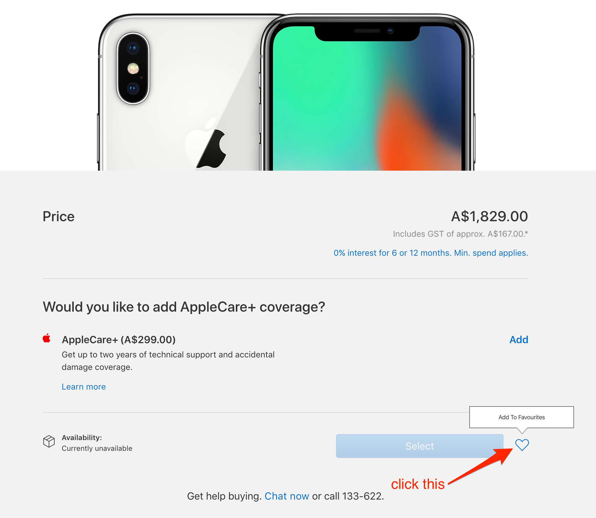

# iPhone X Pre-order Helper
*Automatically check availability and pre-order your iPhone X*

## Usage
1. Visit https://www.apple.com/au/ and sign in (from top right corner) with your Apple account credentials
2. Select your iPhone X model from https://www.apple.com/au/shop/buy-iphone/iphone-x
3. Click the heart button (**Add To Favourites**) besides disabled Select button

  

4. Repeat step 2-3 for more iPhone Xs
5. git clone this repo
6. `yarn install` (recommended) or `npm install`
7. Temporarily expose your Apple account credentials as environment variables in your shell:

  ```shell
  export EMAIL=type_your_apple_email_address_here
  export PASSWD=type_your_apple_password_here
  ```

8. You are all set now. Just run `node .` few minutes before 27 Oct 2017 6:01 pm (pre-order starting point) to automatically check availability and pre-order your iPhone Xs. This script will lead you to your saved favourites checkout screen when iPhone X becomes available.
9. Enjoy!

## Tested with
* macOS 10.13
* node v7.10.1
